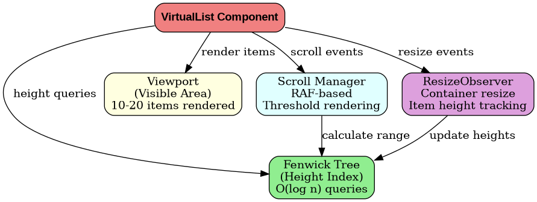

# Diagram Generation System

This system automatically generates beautiful, professional diagrams from code and embeds them in your PDF documentation.

## Overview

Instead of ASCII art diagrams (which often get distorted), we use:

- **Graphviz**: For flowcharts, architecture diagrams, dependency graphs
- **Python**: For automation and integration
- **PNG images**: High-quality output that renders perfectly in PDFs

## Installation

### 1. Install Graphviz (System Package)

**Ubuntu/Debian:**
```bash
sudo apt-get update
sudo apt-get install graphviz
```

**macOS:**
```bash
brew install graphviz
```

**Fedora/RHEL:**
```bash
sudo dnf install graphviz
```

### 2. Install Python Library

```bash
pip3 install graphviz
```

## Usage

### Automatic Generation (Recommended)

The PDF generation script automatically generates diagrams:

```bash
bash generate-pdf.sh
```

This will:
1. Generate all diagrams in the `diagrams/` folder
2. Process the markdown with line breaking
3. Create the PDF with embedded images

### Manual Generation

Generate diagrams only:

```bash
python3 generate_diagrams.py
```

This creates PNG files in `diagrams/`:
- `virtuallist-architecture.png`
- `canvas-architecture.png`
- `reactive-engine-architecture.png`
- `spreadsheet-architecture.png`
- `charts-architecture.png`

### Replace ASCII Art with Images

To update your markdown file with image references:

```bash
python3 generate_diagrams.py frontend-design-problems.md
```

Or create a new file:

```bash
python3 generate_diagrams.py input.md output.md
```

## Current Diagrams

### 1. VirtualList Architecture
Shows the component structure:
- Fenwick Tree for height indexing
- Viewport for rendering
- Scroll Manager
- ResizeObserver

### 2. Canvas Architecture
Displays the canvas rendering system:
- Canvas Manager (Hi-DPI support)
- Layer Manager
- Render Engine
- Interaction handling
- Quadtree spatial indexing

### 3. Reactive Engine Architecture
Illustrates the reactive programming model:
- Signals (state)
- Computed properties
- Effects
- Tracking context
- Scheduler
- Topological sort

### 4. Spreadsheet Architecture
Shows the three-layer system:
- Data Layer (Sparse Matrix, Virtual Viewport)
- Formula Layer (Parser, Dependency Graph, Evaluator)
- UI Layer (Keyboard Nav, Selection, Editor)

### 5. Real-time Charts Architecture
Depicts the data pipeline:
- WebSocket streaming
- Web Worker processing
- Ring Buffer
- Time-series aggregation
- Canvas rendering with RAF
- Viewport culling

## Adding New Diagrams

To add a new diagram, edit `generate_diagrams.py`:

```python
def create_my_diagram():
    from graphviz import Digraph
    
    dot = Digraph(comment='My Diagram', format='png')
    dot.attr(rankdir='TB', size='10,8')
    dot.attr('node', shape='box', style='rounded,filled', fillcolor='lightblue')
    
    # Add nodes
    dot.node('A', 'Component A')
    dot.node('B', 'Component B')
    
    # Add edges
    dot.edge('A', 'B', label='connects to')
    
    return dot
```

Then add it to the `create_all_diagrams()` function:

```python
diagrams = {
    'my-diagram': create_my_diagram(),
    # ... other diagrams
}
```

## Graphviz Features

### Node Shapes
- `box`, `ellipse`, `circle`, `diamond`, `triangle`
- `component`, `folder`, `note`, `tab`

### Styles
- `filled`, `rounded`, `dashed`, `dotted`, `bold`

### Colors
- `lightblue`, `lightgreen`, `lightcoral`, `lightyellow`
- Or use hex: `#FF5733`

### Layouts
- `TB` (top to bottom)
- `LR` (left to right)
- `BT` (bottom to top)
- `RL` (right to left)

### Clusters (Subgraphs)
```python
with dot.subgraph(name='cluster_0') as c:
    c.attr(label='Group Name', style='filled', color='lightgrey')
    c.node('A', 'Node A')
    c.node('B', 'Node B')
```

## Troubleshooting

### "Graphviz not found"

Install the system package:
```bash
sudo apt-get install graphviz
```

### "Permission denied"

Make scripts executable:
```bash
chmod +x generate_diagrams.py generate-pdf.sh
```

### Diagrams not showing in PDF

Check that:
1. Diagrams were generated: `ls diagrams/*.png`
2. Image paths in markdown are correct
3. Pandoc can access the image files

### Poor image quality

Adjust DPI in the diagram creation:
```python
dot.attr(dpi='300')  # Higher quality
```

Or change size:
```python
dot.attr(size='12,10')  # Width,Height in inches
```

## Benefits

1. **No distortion**: Images always render correctly
2. **Professional**: Clean, consistent styling
3. **Maintainable**: Diagrams are code, not manual drawings
4. **Scalable**: Easy to add/modify diagrams
5. **Version control**: Track changes to diagrams in git

## Examples

### Before (ASCII Art)
```
┌─────────────────┐
│  VirtualList    │
├─────────────────┤
│ - Viewport      │
│ - FenwickTree   │
└─────────────────┘
```
Issues: Distorted in PDF, hard to read, limited styling

### After (Generated Diagram)


Benefits: Crystal clear, professional, perfectly formatted

